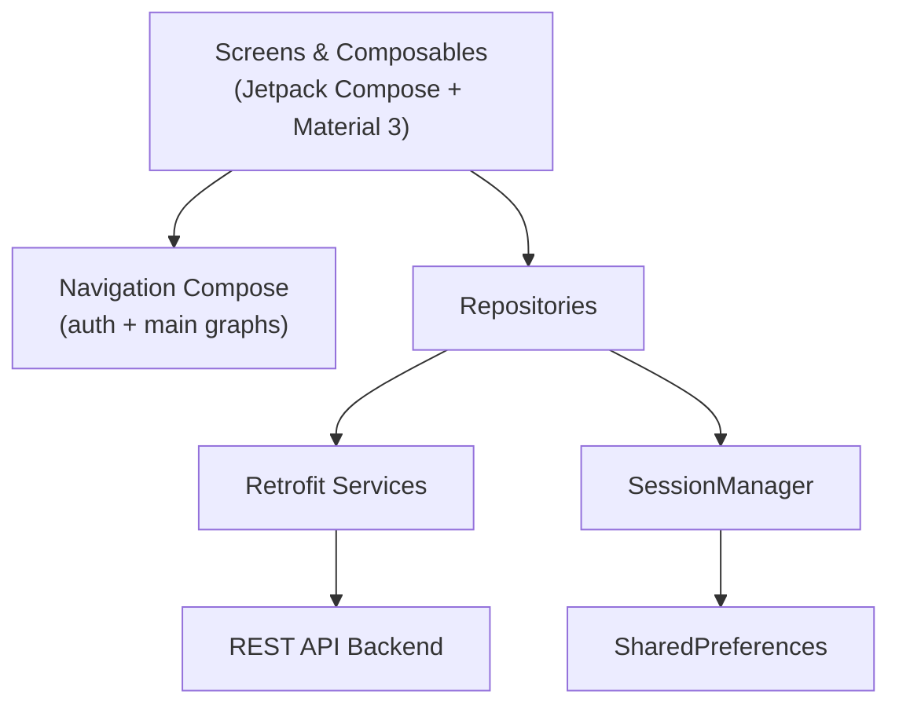

# Listapp

**Listapp** is an Android client for managing shopping lists, product catalogs, and shared pantries. It connects to a private REST API backend so users can organize groceries, track what they already have at home, and collaborate with others on shared lists and pantries.

The interface is built entirely with **Jetpack Compose** and is **Material Design 3** compliant. Navigation is handled with **Navigation Compose**, with patterns chosen to support clear flows, predictable behavior, and good human–computer interaction on phones and tablets.

---

## Authors

- Gerónimo Asín — [gasin@itba.edu.ar](mailto:gasin@itba.edu.ar) 
- Lautaro Ezequiel Domínguez — [ladominguez@itba.edu.ar](mailto:ladominguez@itba.edu.ar)
- Mati Sánchez — [msancheznovelli@itba.edu.ar](mailto:msancheznovelli@itba.edu.ar) 
- Felipe Matich — [fmatich@itba.edu.ar](mailto:fmatich@itba.edu.ar)

---

## Course Info


| Field               | Detail                         |
| ------------------- | ------------------------------ |
| **Course**          | Interacción Hombre-Computadora |
| **Code**            | 72.36                          |
| **Professor**       | Gonzalo Matias Dolagaratz      |
| **Institution**     | ITBA                           |
| **Year / Semester** | 2025 2C                        |


---

## Problem Statement / Motivation

Grocery shopping and pantry management are everyday tasks that become harder when multiple people share a household or when items are spread across different lists and storage locations. Paper lists get lost, messages get buried in chat apps, and it is difficult to know what is already at home versus what still needs to be bought.

Listapp addresses this by providing a single mobile app where users can:

- Maintain categorized product catalogs
- Create and manage shopping lists with purchase tracking
- Track pantry inventory across one or more pantries
- Share lists and pantries with other users

---

## HCI & Design Compliance

As a project for **Interacción Hombre-Computadora (72.36)**, Listapp prioritizes usability, consistency, and accessibility. The UI is not a custom layer on top of Android widgets — it is implemented with Google's recommended modern stack and adheres to platform design standards.

### Jetpack Compose

The entire user interface is built with **Jetpack Compose**, Google's declarative UI toolkit for Android:

- **Composable screens and components** — Each feature (`Login`, `Lists`, `Pantry`, `Products`, `Profile`) is a self-contained Composable; shared UI (forms, dialogs, search bars) lives in reusable composables under `ui/composables/`.
- **State-driven UI** — Screens react to loading, success, and error states so the interface always reflects the current operation (e.g. progress indicators during network calls, disabled buttons while submitting).
- **Single activity architecture** — `MainActivity` hosts the full app; all navigation happens within Compose, reducing context switches and keeping the experience cohesive.

### Material Design 3

Listapp follows **Material Design 3** (Material You) for visual language and interaction patterns:

- **Material 3 components** — `NavigationBar`, `NavigationRail`, `TopAppBar`, `FloatingActionButton`, `Scaffold`, dialogs, text fields, checkboxes, and `Snackbar` for feedback.
- **Theming** — Custom color palette (`LightGreen`, `DeeperGreen`) applied through `MaterialTheme` with consistent typography (Crete Round font family).
- **Visual hierarchy** — Collapsible lists group related content; FABs expose primary actions (create list, add product, add pantry); empty states (`NoItemsMessage`) guide users when there is no data.
- **Feedback** — Loading spinners (`CircularProgressIndicator`) during async operations and snackbars for success/error messages keep users informed without blocking the UI.

### Navigation Compose

**Navigation Compose** structures all app flows with type-safe, declarative routing:

- **Separate navigation graphs** — An auth graph (`login`, `register`, `verification`, `forgot_password`, `reset_password`, `change_password`) and a main app graph (`lists`, `products`, `pantry`, `profile`) keep onboarding isolated from daily use.
- **Predictable navigation** — `launchSingleTop` and `restoreState` preserve tab state when switching sections; the system back button is handled with a custom history stack for intuitive in-app back behavior.
- **Adaptive navigation shell** — `AdaptiveNavBar` switches between a bottom `NavigationBar` (portrait phones) and a side `NavigationRail` (landscape), following Material guidance for different form factors.

### Human–Computer Interaction Practices

Beyond framework compliance, the app applies HCI principles throughout:


| Principle                         | How it is applied                                                                                                 |
| --------------------------------- | ----------------------------------------------------------------------------------------------------------------- |
| **Consistency**                   | Same navigation model, color scheme, and component patterns across all screens                                    |
| **Visibility of system status**   | Loading indicators, snackbar confirmations, and localized error messages (EN / ES)                                |
| **Error prevention & recovery**   | Form validation (password match, quantity checks), clear error strings per HTTP status, password recovery flow    |
| **Recognition over recall**       | Bottom/rail navigation with icons and labels; searchable lists and products; emoji on products for quick scanning |
| **Flexibility & efficiency**      | FABs for frequent actions; inline editing of list names; checkboxes to mark items as purchased                    |
| **Aesthetic & minimalist design** | Focused screens with one primary task; collapsible sections to reduce clutter                                     |
| **Accessibility**                 | `contentDescription` on icons and actions; string resources for all user-facing text                              |
| **Responsive design**             | Tablet-aware layouts (`isTablet()`); adaptive navigation bar vs. rail by orientation                              |


These choices align the implementation with both **Google's Android design guidelines** and the **usability goals** of the HCI course: interfaces that are learnable, efficient, error-tolerant, and pleasant to use.

---

## Features

- **User authentication** — Register, log in, email verification, forgot/reset password, and change password
- **Profile management** — View and edit user profile; log out securely
- **Products** — Browse products by category, search, create categories, add/edit/delete products (with emoji support)
- **Shopping lists** — Create, rename, and delete lists; add items with quantity and unit; mark items as purchased; search lists
- **List sharing** — Share shopping lists with other users by email; view and manage shared users
- **Pantries** — Create multiple pantries, add/edit/remove items, search pantry contents, and share pantries with others
- **Material Design 3 UI** — Consistent components, theming, and visual feedback across the app
- **Jetpack Compose** — Fully declarative, state-driven interface with reusable composables
- **Navigation Compose** — Structured auth and main-app flows with state-preserving tab navigation
- **Adaptive UI** — Bottom navigation on phones, navigation rail in landscape; tablet-aware layouts
- **Localization** — English and Spanish string resources

---

## Tech Stack

The frontend stack is aligned with **Google's recommended Android UI architecture** for modern apps:


| Layer             | Technologies                                                   |
| ----------------- | -------------------------------------------------------------- |
| **Language**      | Kotlin                                                         |
| **UI framework**  | **Jetpack Compose** (100% Compose UI — no XML layouts)         |
| **Design system** | **Material Design 3** (`MaterialTheme`, Material 3 components) |
| **Navigation**    | **Navigation Compose** (nested graphs, type-safe routes)       |
| **Networking**    | Retrofit 2, OkHttp, Kotlinx Serialization                      |
| **Architecture**  | Repository pattern, suspend functions for async API calls      |
| **Persistence**   | SharedPreferences (auth token via `SessionManager`)            |
| **Build**         | Gradle (Kotlin DSL), Android Gradle Plugin 8.13                |
| **Testing**       | JUnit 4, Espresso, Compose UI Test                             |
| **Backend**       | External REST API (not included in this repository)            |


**Minimum SDK:** 29 (Android 10)  
**Target / Compile SDK:** 36

---

## Project Structure

```
listapp-Android/
├── app/
│   ├── src/main/
│   │   ├── java/ar/edu/itba/listapp/
│   │   │   ├── MainActivity.kt              # App entry point and navigation graph
│   │   │   ├── data/
│   │   │   │   ├── model/                   # Request/response data classes
│   │   │   │   └── network/                 # API services, repositories, session
│   │   │   └── ui/
│   │   │       ├── composables/             # Reusable UI components (forms, dialogs)
│   │   │       ├── layouts/                 # Base layout and navigation shell
│   │   │       ├── screens/                 # Feature screens (Login, Lists, Pantry…)
│   │   │       ├── theme/                   # Colors, typography, Material theme
│   │   │       └── utils/                   # Screen helpers (e.g. tablet detection)
│   │   └── res/                             # Strings, drawables, themes, fonts
│   ├── src/test/                            # Local unit tests
│   └── src/androidTest/                     # Instrumented tests
├── gradle/                                  # Version catalog and wrapper
├── build.gradle.kts                         # Root build configuration
└── settings.gradle.kts
```

---

## Setup & Installation

### Prerequisites

- [Android Studio](https://developer.android.com/studio) (latest stable recommended)
- JDK 11+
- Android SDK with API 36
- A running instance of the **Listapp REST API backend** on port `8080`

### Installation

1. Clone the repository:
  ```bash
   git clone https://github.com/GeronimoAsin/listapp-Android.git
   cd listapp-Android
  ```
2. Open the project in Android Studio and let Gradle sync.
3. Configure the API base URL if needed in `app/src/main/java/ar/edu/itba/listapp/data/network/ApiConfig.kt`:
  ```kotlin
   const val BASE_URL = "http://10.0.2.2:8080/api/"
  ```

  | Environment                    | Typical `BASE_URL`                   |
  | ------------------------------ | ------------------------------------ |
  | Android Emulator               | `http://10.0.2.2:8080/api/`          |
  | Physical device (same network) | `http://<your-machine-ip>:8080/api/` |

4. Start the backend API before launching the app.
5. Run the app on an emulator or physical device (Run ▶ in Android Studio, or):
  ```bash
   ./gradlew installDebug
  ```

### Environment Variables

This project does not use `.env` files. The only runtime configuration is the `BASE_URL` constant in `ApiConfig.kt`.

---

## Usage

### First-time flow

1. **Register** — Open the app, tap *Register*, and complete name, surname, nickname, email, and password.
2. **Verify email** — Enter the verification code sent to your email.
3. **Log in** — Sign in with your credentials.

### Main app sections


| Tab          | What you can do                                                                                |
| ------------ | ---------------------------------------------------------------------------------------------- |
| **Lists**    | Create shopping lists, add products with quantity/unit, check off purchased items, share lists |
| **Products** | Manage categories and products; search the catalog                                             |
| **Pantry**   | Create pantries, add inventory items, search, share pantries                                   |
| **Profile**  | View/edit profile, change password, log out                                                    |


### Example workflow

1. Go to **Products** → create a category (e.g. *Dairy*) → add a product (e.g. 🥛 *Milk*).
2. Go to **Lists** → create *Weekly groceries* → add *Milk* with quantity `2` and unit `L`.
3. Go to **Pantry** → create *Home pantry* → add *Milk* with quantity `1` and unit `L`.
4. While shopping, open the list and mark *Milk* as purchased using the checkbox.

### Password recovery

1. On the login screen, tap *Forgot your password?*
2. Enter your email and receive a reset code.
3. Enter the code and set a new password.

---

## Architecture / Design

The app follows a layered structure. The presentation layer is fully **Compose-based** and **Material Design 3–compliant**; see [HCI & Design Compliance](#hci--design-compliance) for a detailed breakdown of UI/UX decisions.




### Key design decisions

- **Jetpack Compose** — Declarative UI with reusable composables; state drives what the user sees
- **Material Design 3** — Standard components, custom theme, snackbars, FABs, and adaptive navigation patterns
- **Navigation Compose** — Separate graphs for auth flow (`login`, `register`, …) and main app (`lists`, `products`, `pantry`, `profile`); `launchSingleTop` + `restoreState` for tab persistence
- **Repository pattern** — `AuthRepository`, `ProductRepository`, `ListRepository`, and `PantryRepository` encapsulate API calls and error mapping into user-friendly messages
- **Retrofit + Kotlinx Serialization** — Type-safe HTTP communication
- **Centralized networking** — `NetworkModule` configures OkHttp (auth headers, logging) and exposes service interfaces
- **Sealed result types** — Repositories return typed results (e.g. `LoginResult`, `ProfileResult`) for explicit success/error handling in the UI

---

## Example Programs

These are representative end-to-end scenarios you can run against a configured backend:

### 1. Register and verify a new user

```
Input:  email=user@example.com, password=secret123, name=John, surname=Doe
Steps:  Register → enter verification code from email → Log in
Output: User lands on the Lists screen with an active session
```

### 2. Create a shared shopping list

```
Input:  List name="BBQ Party", share with friend@example.com
Steps:  Lists → New List → add items → Share → enter email
Output: List visible to both users; shared users shown in list details
```

### 3. Manage pantry inventory

```
Input:  Pantry="Kitchen", product="Rice", quantity=2, unit="kg"
Steps:  Pantry → New Pantry → Add to Pantry → select product and quantity
Output: Item appears in the pantry grid; searchable via the search bar
```

### 4. Mark items as purchased

```
Input:  Shopping list with unchecked items
Steps:  Lists → open list → tap checkbox on an item
Output: Item marked as purchased (PATCH to API)
```

---

## Testing

### Run unit tests (JVM)

```bash
./gradlew test
```

### Run instrumented tests (device/emulator required)

```bash
./gradlew connectedAndroidTest
```

### Current coverage


| Test file                    | What it covers                    |
| ---------------------------- | --------------------------------- |
| `ExampleUnitTest.kt`         | Placeholder unit test             |
| `ExampleInstrumentedTest.kt` | Verifies application package name |


> **Note:** Functional and UI tests for repositories and screens are minimal. See [Future Work](#future-work).

---

## Known Issues / Limitations

- **Backend dependency** — The app requires a running REST API; it does not work standalone.
- **Hardcoded API URL** — `BASE_URL` must be manually updated for physical devices or remote servers.
- **Limited offline support** — No local database cache; all data requires network connectivity.
- **Minimal automated tests** — Only scaffold tests are present; core business logic is not fully covered.
- **HTTP in development** — Default configuration uses plain HTTP (`http://`) for local development; production should use HTTPS.
- **No push notifications** — Sharing and verification rely on the user actively using the app or checking email.

---

## Future Work

- Add comprehensive unit and UI tests for repositories and main screens
- Implement offline caching with Room
- Support deep links for email verification and password reset
- Add barcode scanning for quick product lookup
- Improve error recovery and retry logic for unstable connections
- Add dark theme support
- Publish release builds with a configurable API URL via build variants
- Integrate push notifications for shared list updates

---

## References / Credits

### Android UI & HCI

- [Jetpack Compose](https://developer.android.com/develop/ui/compose) — Declarative UI toolkit used for the entire app
- [Material Design 3](https://m3.material.io/) — Design system and component guidelines
- [Navigation Compose](https://developer.android.com/develop/ui/compose/navigation) — Type-safe in-app navigation
- [Material Design — Usability & Accessibility](https://m3.material.io/foundations/accessible-design/overview)

### Libraries & tools

- [Retrofit](https://square.github.io/retrofit/)
- [OkHttp](https://square.github.io/okhttp/)
- [Kotlinx Serialization](https://github.com/Kotlin/kotlinx.serialization)

